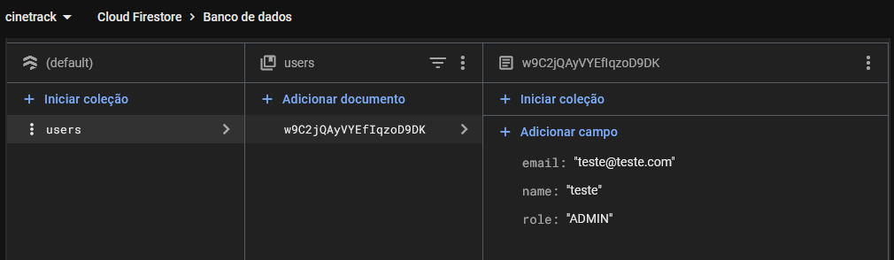

# CineTrack

## 1) Problema
Após assistir um movie, sempre fica um sentimento bom ou ruim. Pensamentos como "esse movie é a coisa mais xexelenta que já vi" ou "melhor coisa que já me aconteceu foi assistir esse movie", de qualquer forma, é preciso ter um local para expressar e compartilhar essa experiência.
No início, o foco será users online com o objetivo de disponibilizar um espaço (site) para rating de movies, incluindo nota e comentários. 

## 2) Atores e Decisores (quem usa / quem decide)
**users principais**: users online

**Decisores/Apoiadores**: Adm

## 3) Casos de uso (de forma simples)
**Todos**: Logar/deslogar, configuração conta, CRUD `rating`

**user**: CRUD `user` (inserir, editar, remover), CRUD `movies` (listar), CRUD `rating` (inserir, listar, editar, remover)

**Adm**: CRUD de `movies` (inserir, listar, editar, remover), CRUD de `rating` (listar, remover)

## 4) Limites e suposições
<!-- Simples assim:
- Limites = regras/prazos/obrigações que você não controla.
- Suposições = coisas que você espera ter e podem falhar.
- Plano B = como você segue com a 1ª fatia se algo falhar.
EXEMPLO:
Limites: entrega final até o fim da disciplina (ex.: 2025-11-30); rodar no
navegador; sem serviços pagos.
Suposições: internet no laboratório; navegador atualizado; acesso ao GitHub; 10
min para teste rápido.
Plano B: sem internet → rodar local e salvar em arquivo/LocalStorage; sem tempo do
professor → testar com 3 colegas. -->
**Limites**: entrega ginal até o fim da disciplina (12/25), rodar no navegador, sem serviços pagos.

**Suposições**: internet no laboratório; navegador atualizado; acesso ao GitHub; 10
min para teste rápido.

**Plano B**: customizar o código com o que está funcionando

## 5) Hipóteses + validação
<!-- Preencha as duas frases abaixo. Simples e direto.
EXEMPLO Valor: Se o aluno ver sua posição na fila, sente mais controle e conclui
melhor a atividade.
Validação: teste com 5 alunos; sucesso se ≥4 abrem/fecham chamado sem ajuda.
EXEMPLO Viabilidade: Com app no navegador (HTML/CSS/JS + armazenamento local),
criar e listar chamados responde em até 1 segundo na maioria das vezes (ex.: 9 de
cada 10).
Validação: medir no protótipo com 30 ações; meta: pelo menos 27 de 30 ações (9/10)
em 1s ou menos. -->
**H-Valor**: Se user tem um espaço para opinar, se sente mais confortável em se expressar e melhora o humor.

**Validação** (`rating`): teste com 5 users; sucesso se ≥4 avaliam com comentários e nota; falha se ≥4 avaliam com apenas nota; alvo: rating com nota e comentário.

**H-Viabilidade**: Com app no navegador (flutter), criar e responder requisições sem disparar erros.

**Validação** (`no_error`): medir no protótipo com 10 ações; meta: mínimo de erros disparados.

## 6) Fluxo principal e primeira fatia
<!-- Pense “Entrada → Processo → Saída”.
EXEMPLO de Fluxo:
1) Aluno faz login
2) Clica em "Pedir ajuda" e descreve a dúvida
3) Sistema salva e coloca na fila
4) Lista mostra ordem e tempo desde criação
5) Professor encerra o chamado
EXEMPLO de 1ª fatia:
Inclui login simples, criar chamado, listar em ordem.
Critérios de aceite (objetivos): criar → aparece na lista com horário; encerrar →
some ou marca "fechado". -->
**Fluxo principal (curto):**
1) user faz login 
2) Acessa a Home Page
3) Procura/seleciona movie
4) Clica em "Avaliar"
5) Escreve comentário (opcional) e seleciona nota
6) Clica em "Enviar"
   
**Primeira fatia vertical (escopo mínimo):**

Inclui: login, valida dados no Firebase, retorna mensagem de erro ou entra no site, carrega lista de movies.

Critérios de aceite:
- Sucesso ao validar dados

## 7) Esboços de algumas telas (wireframes)

## 8) Tecnologias
<!-- Liste apenas o que você REALMENTE pretende usar agora. -->
### 8.1 Navegador
**Navegador:** Flutter/Dart
**Armazenamento local (se usar):** LocalStorage
**Hospedagem:** GitHub Pages
### 8.2 Front-end (servidor de aplicação, se existir)
**Front-end (servidor):** -
**Hospedagem:**  -
### 8.3 Back-end (API/servidor, se existir)
**Back-end (API):** Python
**Banco de dados:** Firebase
**Deploy do back-end:** -
## 9) Plano de Dados (Dia 0) — somente itens 1–3
### 9.1 Entidades
- [User] — user pode ser user ou admin
- [Movie] — movies cadastrados
- [Rating] - avaliacoes relacionadas a movie e user

### 9.2 Campos por entidade
<!-- Use tipos simples: uuid, texto, número, data/hora, booleano, char. -->
### User
| Campo           | Tipo               | Obrigatório | Exemplo                 |
|-----------------|--------------------|-------------|-------------------------|
| id              | string             | sim         | RKFdhsiudhKdjaniL       |
| name            | texto              | sim         | "Ana Souza"             |
| email           | texto              | sim (único) | "ana@exemplo.com"       |
| role            | texto (USER;ADMIN) | sim         | 0                       |
| create_date     | data/hora          | sim         | 2025-08-20 14:30        |
| update_date     | data/hora          | sim         | 2025-08-20 15:10        |

### Movie
| Campo           | Tipo               | Obrigatório | Exemplo                 |
|-----------------|--------------------|-------------|-------------------------|
| id              | string             | sim         | DKFdhsiudhKdjaniL       |
| title           | texto              | sim         | "Senhor dos Anéis"      |
| url_image       | texto              | não         |                         |
| year            | número             | sim         | 1972                    |
| summary         | texto              | sim         | "texto"                 |
| directors       | array              | sim         | [texto]                 |
| genres          | array              | sim         | [texto]                 |
| create_date     | data/hora          | sim         | 2025-08-20 14:30        |
| update_date     | data/hora          | sim         | 2025-08-20 15:10        |

### Rating
| Campo           | Tipo               | Obrigatório | Exemplo                 |
|-----------------|--------------------|-------------|-------------------------|
| id              | string             | sim         | LKFdhsiudhKdjaniL       |
| rating          | número             | sim         | 3.5                     |
| comment         | texto              | não         | "Muito ruim"            |
| movie_id        | string (fk)        | sim         | DKFdhsiudhKdjaniL       |
| user_id         | string (fk)        | sim         | RKFdhsiudhKdjaniL       |
| create_date     | data/hora          | sim         | 2025-08-20 14:30        |
| update_date     | data/hora          | sim         | 2025-08-20 15:10        |

### 9.3 Relações entre entidades
- Um [movie] tem muitos [ratings]. (1→N)
- Um [rating] pertence a um [movie]. (N→1)
- Um [user] tem muitos [ratings], (1→N)
- Um [rating] pertence a um [user]. (N→1)

### 9.4 Modelagem do banco de dados no Firestore
